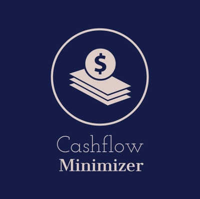

<!-- PROJECT LOGO -->
 

  

<h3 align="center">Cashflow Minimization Utility</h3>

  

    a small tool for simulating minimizatin of cashflow among a group of people using efficient algorithms
     
    <a href="https://github.com/thetechgeeek/Cashflow-Minimization"><strong>Explore the docs »</strong></a>
     
     
    <a href="https://cashflow-minimization.herokuapp.com/">View Live version(Takes 10s to load)</a>
    ·
    <a href="https://github.com/thetechgeeek/Cashflow-Minimization/issues">Report Bug</a>
    ·
    <a href="https://github.com/thetechgeeek/Cashflow-Minimization/issues">Request Feature</a>
  

<!-- TABLE OF CONTENTS -->

  
Table of Contents

  <ol>
    <li>
      <a href="#about-the-project">About The Project</a>
      <ul>
        <li><a href="#built-with">Built With</a></li>
      </ul>
    </li>
    <li><a href="#license">License</a></li>
  </ol>

<!-- ABOUT THE PROJECT -->
## About The Project

[![Product Name Screen Shot][product-screenshot]](https://cashflow-minimization.herokuapp.com/)

(<a href="#top">back to top</a>)

### Built With

## Tech Stack

**Client:** React, Context-API, Bootstrap
**Server:** Node.js, Express
**Database:** MongoDB

(<a href="#top">back to top</a>)

<!-- LICENSE -->
## License

Distributed under the MIT License.

(<a href="#top">back to top</a>)

<!-- MARKDOWN LINKS & IMAGES -->
[product-screenshot]: main_cashflow.gif
